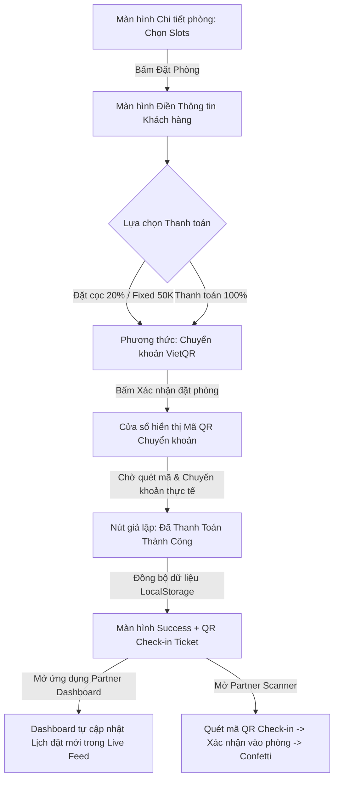

# Hướng dẫn thiết kế Luồng Đặt phòng & Đặt cọc Không cần Backend (High-Fidelity Demo)

Tài liệu này hướng dẫn bạn cách thiết kế và triển khai một **luồng đặt phòng (booking flow) và thanh toán đặt cọc (deposit payment)** hoạt động 100% ở phía Frontend (Serverless Demo) nhưng đem lại trải nghiệm mượt mà, chân thực như một ứng dụng thực tế có Backend.

---

## 🛠️ Triết lý Thiết kế: "Mô phỏng như thật" (High-Fidelity Simulation)

Do hiện tại dự án chưa kết nối với Cơ sở dữ liệu và Backend, chúng ta sẽ tận dụng các công cụ mạnh mẽ của trình duyệt để vận hành:
1. **Mock Database (`LocalStorage`)**: Lưu trữ và truy xuất các lịch đặt phòng (`dinomad_bookings`) theo thời gian thực giữa Khách hàng và Đối tác (Partner).
2. **VietQR API Công cộng (Mô phỏng Thanh toán Thật)**: Sử dụng các dịch vụ tạo ảnh QR ngân hàng miễn phí như `img.vietqr.io`. Khi người dùng quét mã bằng ứng dụng ngân hàng thực tế, số tiền và nội dung chuyển khoản sẽ được tự động điền (Auto-fill) 100% khớp với phòng họ đã chọn!
3. **Cơ chế Đồng bộ Hóa Quốc tế (i18n)**: Sử dụng `next-intl` để đảm bảo luồng thanh toán dịch tốt cả tiếng Anh lẫn tiếng Việt.

---

## 🧭 Kiến trúc luồng đi (User Flow) của Demo



---

## 💻 Hướng dẫn Triển khai Từng Bước (Step-by-Step Implementation)

### Bước 1: Cho phép chọn loại thanh toán (Đặt cọc vs 100%) tại `checkout/page.tsx`
Trong phần chọn phương thức thanh toán, thêm lựa chọn:
*   **Thanh toán Đặt cọc (Deposit Only):** Trả trước một khoản cố định (Ví dụ: `50.000 ₫` hoặc `20%` tổng tiền) để giữ chỗ chống bùng lịch. Phần còn lại thanh toán trực tiếp tại quán.
*   **Thanh toán 100% (Full Payment):** Trả toàn bộ tiền thuê phòng online.

```tsx
// Gợi ý code định nghĩa số tiền đặt cọc trong checkout:
const isDeposit = state.paymentMode === "deposit";
const depositAmount = isDeposit ? 50000 : checkoutTotal; // Cố định 50,000đ giữ chỗ
```

### Bước 2: Tạo Modal/Khối chuyển khoản VietQR Động
Thay vì hiển thị ảnh tĩnh tẻ nhạt, hãy sử dụng VietQR API động. Khi người dùng bấm "Tiến hành thanh toán", hiển thị một màn hình/modal thanh toán chuyên nghiệp với:
1.  **Mã QR ngân hàng thực tế tạo tự động:**
    ```
    https://img.vietqr.io/image/<Mã_Ngân_Hàng>-<Số_Tài_Khoản>-compact.png?amount=<Số_Tiền>&addInfo=DINOMAD%20<Mã_Booking>
    ```
    *Ví dụ thực tế:* `https://img.vietqr.io/image/vietinbank-123456789-compact.png?amount=50000&addInfo=DINOMAD%20BK015`
2.  **Bộ đếm ngược thời gian thanh toán (Payment Countdown):** 10 phút. Nếu hết giờ mà chưa bấm thanh toán, tự động hủy phiên để mở khóa chỗ.
3.  **Nút bấm Trải nghiệm Khách hàng:**
    *   `[Tôi đã chuyển khoản]`: Hiện thông báo "Hệ thống đang đối soát tự động..." kèm loading khoảng 2 giây, sau đó chuyển hướng.
    *   `[Giả lập thanh toán thành công (Dành cho Dev)]` *(Rất quan trọng cho Demo)*: Bấm phát chuyển thẳng qua trang Success kèm hiệu ứng pháo hoa `canvas-confetti`.

### Bước 3: Tạo và Đồng bộ hóa Dữ liệu với `LocalStorage`
Khi thanh toán thành công, ghi đè trạng thái booking vào `LocalStorage` thông qua Store:

```typescript
// Trạng thái booking lưu vào localStorage
const newBooking = {
  id: bookingId,
  roomId: room.id,
  roomName: room.name,
  date: selectedDate,
  startTime: startTime,
  endTime: endTime,
  totalPrice: checkoutTotal,
  paidAmount: depositAmount,         // Số tiền thực tế đã đặt cọc
  paymentStatus: "deposited",        // Trạng thái: Đã đặt cọc (hoặc "fully_paid")
  status: "confirmed",               // Trạng thái đặt chỗ
  checkInQr: `DINOMAD-${bookingId}`, // Mã QR dùng để check-in tại quầy
  createdAt: new Date().toISOString(),
};
```

### Bước 4: Tạo Vé Check-in Tuyệt đẹp ở trang `checkout/success/page.tsx`
*   Hiển thị thông tin đặt phòng dưới dạng một chiếc **Vé vật lý (Ticket Card)** với các góc bo tròn mềm mại.
*   Hiển thị mã QR check-in bằng cách import component `<QrCode data={`DINOMAD-${bookingId}`} size={160} />` có sẵn trong dự án.
*   Hiển thị các nút thao tác nhanh: "Về trang chủ", "Xem lịch đặt của tôi (My Bookings)", "Tải vé điện tử".

### Bước 5: Liên kết dữ liệu với Giao diện Đối tác (Partner) & Quét QR
Để chứng minh luồng hoạt động khép kín (End-to-End Demo):
1.  **Partner Dashboard (`partner/page.tsx`):**
    Cập nhật code phần danh sách hoạt động gần đây (`Live Feed`) và `Requires Action` để tự động đọc dữ liệu từ `localStorage.getItem("dinomad_bookings")`. Mỗi khi khách hàng đặt phòng thành công, lịch đặt đó sẽ **lập tức xuất hiện** trên dashboard của chủ quán!
2.  **QR Scanner Simulator (`partner/scanner/page.tsx`):**
    Thiết kế một màn hình giả lập camera quét mã QR. Cho phép nhập mã Booking ID hoặc nhấn nút "Simulate Scan Ticket". Hệ thống sẽ tìm trong `localStorage`, đổi trạng thái lịch đặt thành `checked_in`, và kích hoạt hiệu ứng pháo hoa chúc mừng khách vào phòng họp thành công!

---

## 💡 Lợi ích của Phương pháp này
- **Không tốn chi phí vận hành:** Hoàn toàn chạy client-side, không cần thuê database/server.
- **Trải nghiệm thật 100%:** Việc quét mã QR ngân hàng thật giúp người dùng và nhà đầu tư vô cùng ấn tượng.
- **Dễ dàng chuyển đổi lên hệ thống thật:** Khi có API từ Backend, bạn chỉ việc thay thế hàm `localStorage` và `setTimeout` bằng các truy vấn `fetch()` hoặc `axios` thực tế mà không cần viết lại giao diện.
